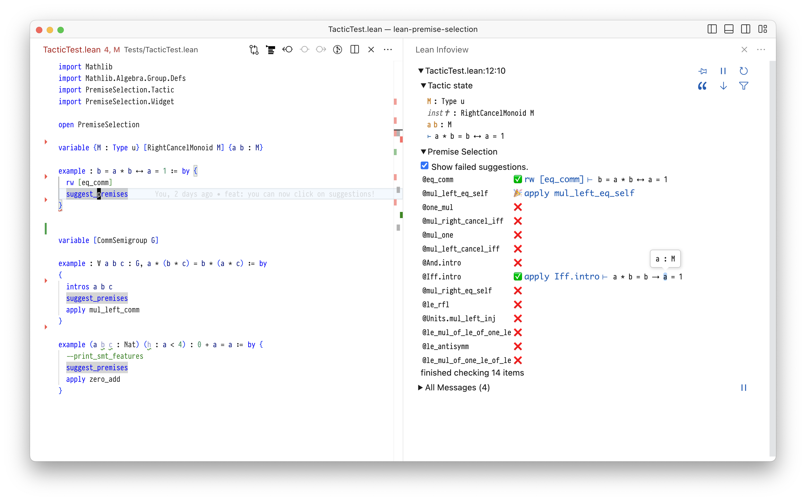

# Premise selection for Lean



The aim of this project is to provide a tool for premise selection for Lean
users.

The premise selection mechanism is based on machine learning -- a custom
version of the random forest algorithm.

The machine learning model is trained on data extracted from `mathlib`. Each
training data point is a pair `(features T, premises T)`, where `T` is a theorem,
`features T` are features of a statement of `T` extracted by our featurizer, and
`premises T` is a list of names of premises used in a proof of `T`.

The user can ask for advice from the trained model by using the provided tactic
`suggest_premises`. It returns a ranking of premises likely useful for proving a
theorem at hand. The user may also extract their own training data and train
their own machine learning model for premise selection.

The paper describing the design of the tool and its evaluation was accepted to TABLEAUX 2023 is available [here](https://arxiv.org/pdf/2304.00994.pdf).


# Getting started

Make sure that `elan` is installed and up to date. Build the project by running:
```
lake build
```


# Building the widget

In order to use `suggest_premises` tactic and see the interactive list of
premises you need to run the following:

```
cd widget
npm i
npm run build -- --tsxName index
```

Then using VS Code, head over to `TacticTest.lean` and hover on
`suggest_premises`.


# Downloading pre-trained models

The random forest model invoked by the `suggest_premises` is stored at
`data/forest.source.nb.small`. This is a smaller model included in the
repository mainly for the purpose of demonstration. One can download
'full-size', more capable models by running:

```
wget -P data http://grid01.ciirc.cvut.cz/~bartosz/forest.all.nb
wget -P data http://grid01.ciirc.cvut.cz/~bartosz/forest.source.nb
wget -P data http://grid01.ciirc.cvut.cz/~bartosz/forest.math.nb
```

These three models were trained using a combination of `name` and `bigram`
features, on `all`, `source`, and `math` premises, respectively (see the
associated paper for an explanation). In order to use them, change the path in
the definition of `trainedForest` in `PremiseSelection/Tactic.lean`.

# Reproducing evaluation

To reproduce the evaluation of the machine learning predictors, as described in
the associated paper, first, data needs to be extracted, and then split into
training and testing parts. Then, a machine learning model may be trained, and
its predictions compared to the ground truth. Instructions below.

## Extracting data

To extract data from all the available modules run
```
./util/extract-from-all-modules.sh [+all] [+source] [+math] [+n] [+b] [+t]
```

The meaning of the flags (compatible with the associated paper)
is the following:
`+all` -- all but auxiliary, automatically generated premises are extracted
`+source` -- premises explicitly used in the source files are extracted
`+math` -- 'mathematical' premises listed in `math_names` are extracted
`+n` -- `name` features are used
`+b` -- `bigram` features are used
`+t` -- `trigram` features are used

The extracted data will be stored in the directory `data/extracted.$PARAMS`
where `$PARAMS` is a list of parameters (separated by `.`) passed to the
extracting script (e.g., `extracted.+source.+n.+b`).

Note, that you need to select at least one option out of `+n`, `+b`, `+t`.
Otherwise an error will occur.

## Training and evaluating machine learning models

To test the performance of the implemented machine learning algorithms (random
forest and k-nearest neighbours), one should split the extracted data into
training and testing parts:

```
./util/list-sinks.sh # extract list of modules not being deps of other modules
./util/train-test-split.sh data/extracted.$PARAMS
```

This will produce 4 files:
```
data/extracted.$PARAMS.train.labels
data/extracted.$PARAMS.train.features
data/extracted.$PARAMS.test.labels
data/extracted.$PARAMS.test.features
```

### Evaluating random forest

To train a random forest model and evaluate its predictive performance on the
testing part of the data, run the following:
```
./util/train-and-predict-rf.sh data/extracted.$PARAMS
```

Random forest model will be trained and saved, and its predictions will be saved
and compared against the true labels in terms of the Cover measure specified in
`util/cover.py`.


### Evaluating k-nearest neighbours

To evaluate k-nearest neighbours predictive performance on the testing part
of the data, run the following:
```
./util/predict-knn.sh data/extracted.$PARAMS
```
The predictions will be saved and compared against the true labels in terms of
the Cover measure specified in `util/cover.py`.


# Development

If you edit the `widget` directory, after running `npm run build -- --tsxName
index`, you should also delete the `build` directory to force Lean to refresh
and use the new version.
